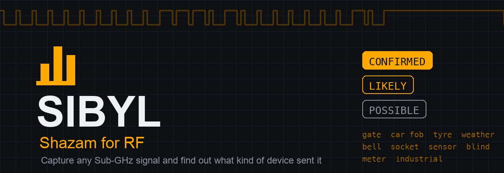
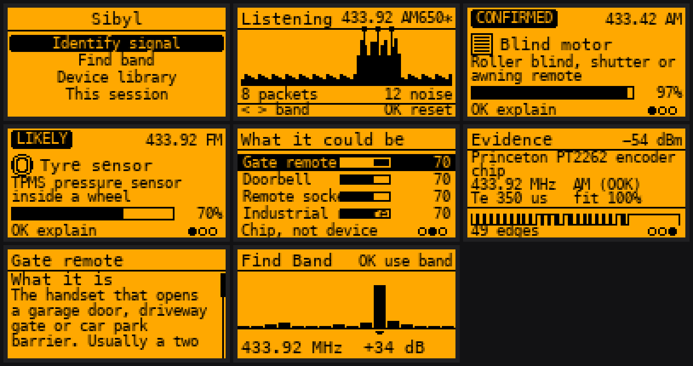
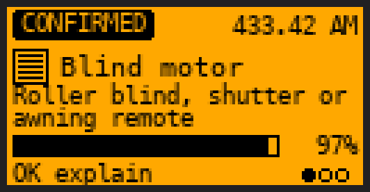
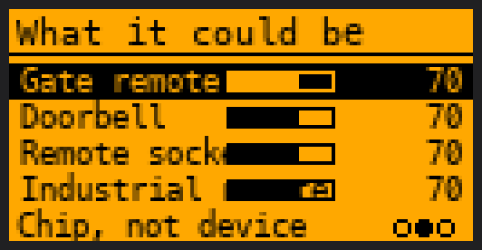
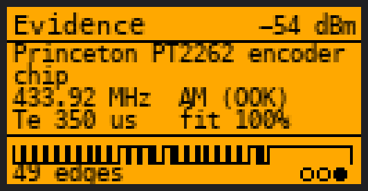
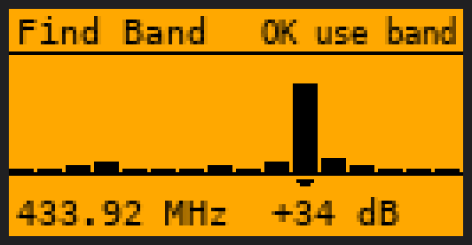

<div align="center">



**Shazam for RF.** Capture any Sub-GHz signal on a Flipper Zero and find out what kind
of device sent it — then learn how that device works and what it means for its security.

[](https://github.com/at0m-b0mb/Sibyl-FlipperZero/actions/workflows/build.yml)
[](LICENSE)


</div>

---

## What it does

Point Sibyl at a transmitting remote, sensor or fob. It captures the packet, works out
what kind of thing sent it, and — this is the part that matters — tells you how much
that answer is actually worth.



There are **two completely different kinds of answer**, and Sibyl never lets them blur
into each other.

**Decoded.** The Flipper's own protocol stack recognised the packet and named it. That
is a fact about the bits, not a guess. Some of those names belong to exactly one kind of
product — a Somfy Telis packet comes out of a blind or awning motor and nothing else —
and those are the only results Sibyl will ever mark `CONFIRMED`.

**Fingerprinted.** Nothing decoded, so all there is to go on is the shape of the signal:
which band, which modulation, the symbol width, how long the packet was, how many times
it repeated. That narrows the field a great deal, and it is genuinely useful — it is how
a tyre sensor or an off-brand weather station still gets identified — but it is
inference. It is capped below `CONFIRMED` however neat it looks, and it is always shown
as a ranked shortlist rather than a single confident answer.

### Naming a chip is not naming a device

This is the mistake most signal tools make, so it gets its own flag.

Princeton (PT2262), EV1527, Holtek and KeeLoq are **encoder chips**. They are sold by the
reel and fitted to gate remotes, doorbells, mains sockets, PIR sensors and garden lights
alike. When one of those decodes, you have learned something real — the code is fixed and
therefore replayable, or it rolls and therefore is not — but you have **not** learned what
the code opens.

So Sibyl says `Chip, not device`, shows you the shortlist, and refuses to pick whichever
one sounds best.

<div align="center">

| | |
|:--:|:--:|
|  |  |
| A protocol that names one product family. | A chip that names none of them. |

</div>

## What it can name

| Class | What it is |
|---|---|
| **Gate remote** | Garage door, gate or barrier handset |
| **Car key fob** | Vehicle remote locking or car alarm handset |
| **Tyre sensor** | TPMS pressure sensor inside a wheel |
| **Weather sensor** | Outdoor temperature, rain or wind transmitter |
| **Doorbell** | Wireless doorbell push button |
| **Remote socket** | Plug-in mains socket or RF light switch |
| **Alarm sensor** | PIR, door contact or smoke detector |
| **Blind motor** | Roller blind, shutter or awning remote |
| **Meter / telemetry** | Utility meter or industrial telemetry |
| **Industrial remote** | Crane, hoist or site machinery control |

Every one of them has a four-part explainer built in — what it is, how the radio link
works, what that means for security, and **what Sibyl cannot tell you about it**. That
last section is not filler; it is the difference between a teaching tool and a magic
answer box. Browse them all from **Device library** without capturing anything.

## How the classification works

The engine measures five things off the raw pulse train and scores them against an
envelope for each device class.

| Measurement | Why it discriminates |
|---|---|
| **Te** — the symbol quantum | The single most useful number there is. A gate remote lives near 350 µs, a tyre sensor near 50 µs. |
| **Fit** | How cleanly every pulse quantises to a whole multiple of Te. High fit means a real clocked packet; low fit means noise, or the wrong modulation. |
| **Repeats** | A doorbell hammers its code out a dozen times. A tyre sensor sends it twice and goes quiet for a minute. |
| **Burst length** | A TPMS packet is milliseconds long. A blind motor's wake-up preamble is not. |
| **Band + modulation** | Coarse but strong. An OOK preset is deaf to an FSK tyre sensor, and the other way round. |

Weights sum to 100, so a raw score is already a percentage. Then the honesty ceilings
apply:

| Situation | Ceiling |
|---|---|
| Protocol decoded, names one product family | 98 |
| Protocol decoded, names an encoder chip | 74 |
| Nothing decoded, timing measured cleanly | 70 |
| Nothing decoded, pulses did not quantise | 45 |
| No usable timing at all | 40 |

The ceiling is applied as a **curve, not a clip**. Clipping was the first implementation
and it was wrong: as soon as two classes both scored above the ceiling they landed on the
same number, the ordering collapsed into whatever the loop happened to visit first, and
the app confidently announced that a tyre sensor was a car key. The curve is linear up to
three quarters of the ceiling and compresses everything above into the last quarter, so
order and relative distance survive and only a perfect match reaches the top.

### Evidence, not vibes

The third page shows the measured numbers **and draws the captured packet as a logic
trace**. If that trace does not look like a packet, the answer above it should not be
believed — and now you can tell.

<div align="center">



</div>

The same measurement is also the noise gate. A run of pulses counts as a packet when a
single symbol quantum explains their widths; uniform receiver noise has no such quantum
and scores far below the threshold. Nothing has to be tuned per band or per gain setting,
and the `noise` counter on the listening screen tells you honestly how much was thrown
away.

## Using it

**Identify signal** — start listening, then press your remote.

The carrier trace scrolls right to left with a mark on every packet that was accepted.
That is not decoration: it is how you tell *nothing is happening* apart from *something
is happening here but Sibyl cannot make a packet out of it*, which are the two situations
you need to distinguish before changing any settings.

| Key | While listening | On the result |
|---|---|---|
| `←` `→` | change band | walk the three pages |
| `↑` `↓` | — | move down the shortlist |
| `OK` | clear the capture | explain what you are pointing at |

With **Auto mod** on, Sibyl walks the AM and FM presets while nothing is landing. Leave
it on unless you know what you are looking for.

**Find band** — if you do not know the frequency, run this and hold your remote down.
Every band is scored against its own noise floor, so a permanently busy band does not win
by being loud, only by getting *louder* when the button goes down. If nothing rose
meaningfully, it says so rather than pointing at the least quiet one.

<div align="center">



</div>

## Install

Grab `sibyl.fap` from [Releases](https://github.com/at0m-b0mb/Sibyl-FlipperZero/releases)
and drop it in `SD Card/apps/Sub-GHz/` via qFlipper. It appears under **Apps → Sub-GHz →
Sibyl**.

### Build it yourself

```bash
python3 -m pip install --upgrade ufbt
git clone https://github.com/at0m-b0mb/Sibyl-FlipperZero.git
cd Sibyl-FlipperZero
ufbt
```

`dist/sibyl.fap` is the result. `ufbt launch` builds and runs it on an attached Flipper.

## Tests

The classifier, the feature extractor, the reference library and the text layout run on
the host under ASan and UBSan — the first three are pure integer logic with no radio, no
GUI and no floats; the last builds against a stubbed canvas with a known font metric:

```bash
make -C test
```

That is ~4,850 checks over synthetic pulse trains built to look like the real thing —
including the cases where a naive estimator goes wrong. The four that earn their keep:

- **The subharmonic trap.** Widths of 700 µs and 2100 µs are explained perfectly by
  Te = 700, and equally perfectly by 350, 175 and 87. An estimator that simply takes the
  best-scoring candidate settles on a subharmonic and reports every packet as twice the
  bit length it really is.
- **Manchester.** The estimator must not settle on the double-width run, which fits the
  data almost as well and is wrong.
- **The honesty ceilings**, asserted directly rather than inferred from examples — over
  a sweep of a few hundred generated captures, no undecoded signal is ever allowed to
  reach `CONFIRMED`.
- **Text that is wider than the screen.** A word too long for the line can never fit, so
  a wrapper that answers "does not fit" by starting a new line pushes it forward for ever
  and leaves the first row blank. Every string the app draws on a single row is also
  measured against its own budget, pessimistically.

The screenshots above are generated by `tools_gen_mockups.py` from
`test/host_mockup_dump`, which runs the **real** classifier over the **real** extractor
and prints what it decided. Nobody types a confidence figure into the mockup script. If
the scoring changes, the pictures change with it.

## Listen only

Sibyl **never transmits, replays or clones.** It brings the CC1101 up in receive, and
that is all it ever does with it. It does not store codes, and the session list lives in
RAM only — a running log of what transmits around someone, written to their SD card,
would be a surveillance tool, and it should not outlive the app.

Use it on your own equipment, or with permission.

## Limits worth knowing

- **A gate and a garage door are the same radio link** driving different motors. Sibyl
  cannot separate them and does not pretend to.
- **A PIR and a door contact** use the same transmitter and differ only in a byte inside
  the payload.
- **433.92 MHz OOK is crowded.** Gate remotes, doorbells, mains sockets and alarm
  sensors genuinely overlap on every measurement available. When four classes tie, that
  tie *is* the answer.
- The internal CC1101 only receives what its filter passes. If a capture looks weak or
  ragged, try **Find band** — a Somfy remote on 433.42 heard on 433.92 is exactly that.

## Related

Part of a family of Flipper tools: [Aurora](https://github.com/at0m-b0mb/Aurora-FlipperZero)
(band waterfall), [RollCall](https://github.com/at0m-b0mb/RollCall-FlipperZero)
(rolling-code health check), [Odograph](https://github.com/at0m-b0mb/Odograph-FlipperZero)
(TPMS privacy), [Cardea](https://github.com/at0m-b0mb/Cardea-FlipperZero) (relay attack
watch), [Rosetta](https://github.com/at0m-b0mb/Rosetta-FlipperZero) (protocol explainer).

## License

MIT — see [LICENSE](LICENSE).
